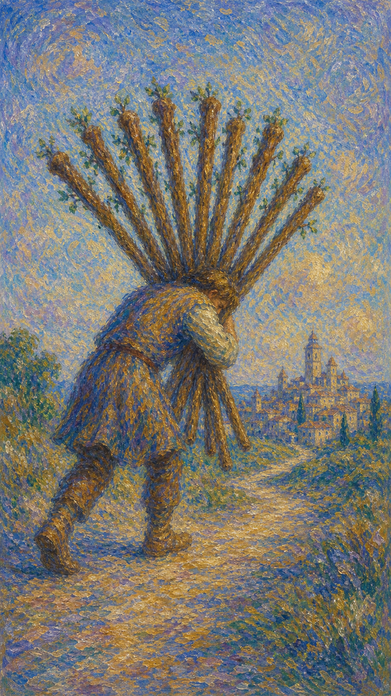

# 权杖十

权杖十把火的热情变成沉重的责任。目标已经在望，肩上的负担也逼近极限，提醒人重新安排承担的方式。

当这张牌出现，说明某件事接近完成，却消耗了过多体力、时间或心理空间。继续前行之前，需要学会分担与取舍。

人物弯身抱着十根权杖走向远处城镇。终点并不遥远，但视线被负担遮住，象征责任过重带来的盲目与疲惫。

## 基础要素

1. 牌名：权杖十 (Ten of Wands)
2. 数字编号：31 号牌
3. 核心主题：负担、责任、压力、接近完成
4. 元素：火
5. 星座或行星：土星在射手座
6. 希伯来字母：无固定传统对应
7. 代表意义：通过承担的极限学习分配力量

## 牌面要素

| 要素 | 含义 |
|------|------|
| 十根权杖 | 过多责任、任务堆积与能量负荷。 |
| 弯腰人物 | 压力沉重，行动受到限制。 |
| 被遮住视线 | 因负担过多而看不清方向。 |
| 远处城镇 | 目标接近完成，终点已经可见。 |
| 独自搬运 | 不愿求助或缺少分工。 |
| 土黄色道路 | 责任需要落地，也带来现实重量。 |

## 塔罗灵数

数字 10 代表一个循环的完成，也预示新阶段即将开始。火来到 10，热情燃烧到极致，开始要求重整。

权杖十的 10 号能量说明：完成并不等于把所有东西都背在自己身上。成熟的责任感懂得分配力量。

## 正位牌意

**关键词**：压力，重担，责任过多，过劳，接近完成，承担，收尾

正位的权杖十表示你背负了太多任务。虽然目标接近，但需要整理优先级，分担压力，避免在完成前耗尽自己。

### 爱情/婚姻

感情中可能一方承担过多家务、情绪劳动或现实责任。关系需要重新分工，让爱回到互相支持，而非单方面负重。

### 事业学业

事业学业上代表任务堆积、项目收尾压力、加班过多或责任集中在自己身上。适合列清单、分阶段完成，并寻求协作。

### 人际财富

人际方面可能被过多请求压住，难以拒绝。财富上可能有债务、家庭开销、工作压力换来的收入，需评估是否值得长期承受。

### 健康生活

健康上提示过劳、肩颈背压力、睡眠不足和长期紧绷。身体正在要求你减重，不宜继续透支。

### 其它牌意

可能代表责任收尾、搬迁劳累、项目负荷、临近终点。若问建议，正位提醒你把负担放到桌面上重新分配。

## 逆位牌意

**关键词**：卸下负担，释放压力，拒绝责任，崩溃边缘，重新分工

逆位的权杖十表示负担正在松动，或已经重到无法继续承受。它可能带来解脱，也可能暴露逃避责任的问题。

### 爱情/婚姻

感情中可能开始要求公平分担，或因长期压力决定放下某段关系模式。若有人长期逃避责任，矛盾会更明显。

### 事业学业

事业学业上可能交付结束、工作量减少，也可能因过劳而效率崩塌。适合重新谈分工、期限和可承受范围。

### 人际财富

人际方面适合学会拒绝，停止替所有人收拾残局。财富上可考虑减债、削减支出、退出消耗型合作。

### 健康生活

健康上提示身体急需减压。若已经出现明显不适，应优先休息、检查和调整生活负荷。

### 其它牌意

事情可能走到必须减重的节点。逆位提醒你：放下部分负担，有时正是让目标顺利抵达的办法。
