# Tarot Corpus Completion Implementation Plan

> **For agentic workers:** REQUIRED SUB-SKILL: Use superpowers:subagent-driven-development (recommended) or superpowers:executing-plans to implement this plan task-by-task. Steps use checkbox (`- [ ]`) syntax for tracking.

**Goal:** Create the remaining 76 tarot interpretation markdown documents, keeping the existing two major arcana files untouched while standardizing all new writing around one approved template.

**Architecture:** Work in content batches that mirror the final information architecture: missing major arcana first, then the four minor arcana suits. Each batch uses the same markdown section order, the same image-path convention, and the same Rider–Waite–Smith / Golden Dawn interpretive baseline, with verification after every batch and one final corpus-wide sweep.

**Tech Stack:** Markdown, Claude Code file tools, Tavily research tools, Python one-off verification scripts run from the repository root

---

## File structure map

### Existing files to preserve

- Keep unchanged: `docs/major/01-the-magician.md`
- Keep unchanged: `docs/major/02-the-high-priestess.md`

### Directories to create

- Create: `docs/minor/wands`
- Create: `docs/minor/cups`
- Create: `docs/minor/swords`
- Create: `docs/minor/pentacles`

### Major arcana files to create

- `docs/major/00-the-fool.md`
- `docs/major/03-the-empress.md`
- `docs/major/04-the-emperor.md`
- `docs/major/05-the-hierophant.md`
- `docs/major/06-the-lovers.md`
- `docs/major/07-the-chariot.md`
- `docs/major/08-strength.md`
- `docs/major/09-the-hermit.md`
- `docs/major/10-wheel-of-fortune.md`
- `docs/major/11-justice.md`
- `docs/major/12-the-hanged-man.md`
- `docs/major/13-death.md`
- `docs/major/14-temperance.md`
- `docs/major/15-the-devil.md`
- `docs/major/16-the-tower.md`
- `docs/major/17-the-star.md`
- `docs/major/18-the-moon.md`
- `docs/major/19-the-sun.md`
- `docs/major/20-judgement.md`
- `docs/major/21-the-world.md`

### Wands files to create

- `docs/minor/wands/22-ace-of-wands.md`
- `docs/minor/wands/23-two-of-wands.md`
- `docs/minor/wands/24-three-of-wands.md`
- `docs/minor/wands/25-four-of-wands.md`
- `docs/minor/wands/26-five-of-wands.md`
- `docs/minor/wands/27-six-of-wands.md`
- `docs/minor/wands/28-seven-of-wands.md`
- `docs/minor/wands/29-eight-of-wands.md`
- `docs/minor/wands/30-nine-of-wands.md`
- `docs/minor/wands/31-ten-of-wands.md`
- `docs/minor/wands/32-page-of-wands.md`
- `docs/minor/wands/33-knight-of-wands.md`
- `docs/minor/wands/34-queen-of-wands.md`
- `docs/minor/wands/35-king-of-wands.md`

### Cups files to create

- `docs/minor/cups/36-ace-of-cups.md`
- `docs/minor/cups/37-two-of-cups.md`
- `docs/minor/cups/38-three-of-cups.md`
- `docs/minor/cups/39-four-of-cups.md`
- `docs/minor/cups/40-five-of-cups.md`
- `docs/minor/cups/41-six-of-cups.md`
- `docs/minor/cups/42-seven-of-cups.md`
- `docs/minor/cups/43-eight-of-cups.md`
- `docs/minor/cups/44-nine-of-cups.md`
- `docs/minor/cups/45-ten-of-cups.md`
- `docs/minor/cups/46-page-of-cups.md`
- `docs/minor/cups/47-knight-of-cups.md`
- `docs/minor/cups/48-queen-of-cups.md`
- `docs/minor/cups/49-king-of-cups.md`

### Swords files to create

- `docs/minor/swords/50-ace-of-swords.md`
- `docs/minor/swords/51-two-of-swords.md`
- `docs/minor/swords/52-three-of-swords.md`
- `docs/minor/swords/53-four-of-swords.md`
- `docs/minor/swords/54-five-of-swords.md`
- `docs/minor/swords/55-six-of-swords.md`
- `docs/minor/swords/56-seven-of-swords.md`
- `docs/minor/swords/57-eight-of-swords.md`
- `docs/minor/swords/58-nine-of-swords.md`
- `docs/minor/swords/59-ten-of-swords.md`
- `docs/minor/swords/60-page-of-swords.md`
- `docs/minor/swords/61-knight-of-swords.md`
- `docs/minor/swords/62-queen-of-swords.md`
- `docs/minor/swords/63-king-of-swords.md`

### Pentacles files to create

- `docs/minor/pentacles/64-ace-of-pentacles.md`
- `docs/minor/pentacles/65-two-of-pentacles.md`
- `docs/minor/pentacles/66-three-of-pentacles.md`
- `docs/minor/pentacles/67-four-of-pentacles.md`
- `docs/minor/pentacles/68-five-of-pentacles.md`
- `docs/minor/pentacles/69-six-of-pentacles.md`
- `docs/minor/pentacles/70-seven-of-pentacles.md`
- `docs/minor/pentacles/71-eight-of-pentacles.md`
- `docs/minor/pentacles/72-nine-of-pentacles.md`
- `docs/minor/pentacles/73-ten-of-pentacles.md`
- `docs/minor/pentacles/74-page-of-pentacles.md`
- `docs/minor/pentacles/75-knight-of-pentacles.md`
- `docs/minor/pentacles/76-queen-of-pentacles.md`
- `docs/minor/pentacles/77-king-of-pentacles.md`

### Shared content rules every created file must follow

- Top-level heading is the Chinese card name only.
- Include one image reference near the top using the final path convention.
- Include these sections in this order:
  - `## 基础要素`
  - `## 牌面要素`
  - `## 塔罗灵数` for major arcana and numbered minor arcana, or an equivalent role/人格 section for court cards while still keeping the `## 塔罗灵数` heading present and explaining the court-card treatment.
  - `## 正位牌意`
  - `## 逆位牌意`
- Inside `## 正位牌意` and `## 逆位牌意`, include these subsections in this order:
  - `### 爱情/婚姻`
  - `### 事业学业`
  - `### 人际财富`
  - `### 健康生活`
  - `### 其它牌意`
- Do not add source lists.
- Do not edit `docs/major/01-the-magician.md` or `docs/major/02-the-high-priestess.md`.

## Research baseline

Use Tavily before drafting each batch. Preferred query form for each card:

- `"<card name> tarot Rider Waite symbolism upright reversed Golden Dawn"`
- `"<card name> tarot love career finances health Rider Waite"`

For court cards, add:

- `"<card name> tarot court card personality elemental dignity"`

When sources disagree, keep one consistent RWS / Golden Dawn interpretation across the corpus instead of mixing systems inside one suit.

## Verification script used after every batch

Run this from the repository root whenever a batch is complete:

```bash
python - <<'PY'
from pathlib import Path
required_sections = [
    '## 基础要素',
    '## 牌面要素',
    '## 塔罗灵数',
    '## 正位牌意',
    '## 逆位牌意',
    '### 爱情/婚姻',
    '### 事业学业',
    '### 人际财富',
    '### 健康生活',
    '### 其它牌意',
]
paths = [
    Path('docs/major/00-the-fool.md'),
    Path('docs/major/03-the-empress.md'),
    Path('docs/major/04-the-emperor.md'),
    Path('docs/major/05-the-hierophant.md'),
    Path('docs/major/06-the-lovers.md'),
    Path('docs/major/07-the-chariot.md'),
    Path('docs/major/08-strength.md'),
    Path('docs/major/09-the-hermit.md'),
    Path('docs/major/10-wheel-of-fortune.md'),
    Path('docs/major/11-justice.md'),
    Path('docs/major/12-the-hanged-man.md'),
    Path('docs/major/13-death.md'),
    Path('docs/major/14-temperance.md'),
    Path('docs/major/15-the-devil.md'),
    Path('docs/major/16-the-tower.md'),
    Path('docs/major/17-the-star.md'),
    Path('docs/major/18-the-moon.md'),
    Path('docs/major/19-the-sun.md'),
    Path('docs/major/20-judgement.md'),
    Path('docs/major/21-the-world.md'),
    Path('docs/minor/wands/22-ace-of-wands.md'),
    Path('docs/minor/wands/23-two-of-wands.md'),
    Path('docs/minor/wands/24-three-of-wands.md'),
    Path('docs/minor/wands/25-four-of-wands.md'),
    Path('docs/minor/wands/26-five-of-wands.md'),
    Path('docs/minor/wands/27-six-of-wands.md'),
    Path('docs/minor/wands/28-seven-of-wands.md'),
    Path('docs/minor/wands/29-eight-of-wands.md'),
    Path('docs/minor/wands/30-nine-of-wands.md'),
    Path('docs/minor/wands/31-ten-of-wands.md'),
    Path('docs/minor/wands/32-page-of-wands.md'),
    Path('docs/minor/wands/33-knight-of-wands.md'),
    Path('docs/minor/wands/34-queen-of-wands.md'),
    Path('docs/minor/wands/35-king-of-wands.md'),
    Path('docs/minor/cups/36-ace-of-cups.md'),
    Path('docs/minor/cups/37-two-of-cups.md'),
    Path('docs/minor/cups/38-three-of-cups.md'),
    Path('docs/minor/cups/39-four-of-cups.md'),
    Path('docs/minor/cups/40-five-of-cups.md'),
    Path('docs/minor/cups/41-six-of-cups.md'),
    Path('docs/minor/cups/42-seven-of-cups.md'),
    Path('docs/minor/cups/43-eight-of-cups.md'),
    Path('docs/minor/cups/44-nine-of-cups.md'),
    Path('docs/minor/cups/45-ten-of-cups.md'),
    Path('docs/minor/cups/46-page-of-cups.md'),
    Path('docs/minor/cups/47-knight-of-cups.md'),
    Path('docs/minor/cups/48-queen-of-cups.md'),
    Path('docs/minor/cups/49-king-of-cups.md'),
    Path('docs/minor/swords/50-ace-of-swords.md'),
    Path('docs/minor/swords/51-two-of-swords.md'),
    Path('docs/minor/swords/52-three-of-swords.md'),
    Path('docs/minor/swords/53-four-of-swords.md'),
    Path('docs/minor/swords/54-five-of-swords.md'),
    Path('docs/minor/swords/55-six-of-swords.md'),
    Path('docs/minor/swords/56-seven-of-swords.md'),
    Path('docs/minor/swords/57-eight-of-swords.md'),
    Path('docs/minor/swords/58-nine-of-swords.md'),
    Path('docs/minor/swords/59-ten-of-swords.md'),
    Path('docs/minor/swords/60-page-of-swords.md'),
    Path('docs/minor/swords/61-knight-of-swords.md'),
    Path('docs/minor/swords/62-queen-of-swords.md'),
    Path('docs/minor/swords/63-king-of-swords.md'),
    Path('docs/minor/pentacles/64-ace-of-pentacles.md'),
    Path('docs/minor/pentacles/65-two-of-pentacles.md'),
    Path('docs/minor/pentacles/66-three-of-pentacles.md'),
    Path('docs/minor/pentacles/67-four-of-pentacles.md'),
    Path('docs/minor/pentacles/68-five-of-pentacles.md'),
    Path('docs/minor/pentacles/69-six-of-pentacles.md'),
    Path('docs/minor/pentacles/70-seven-of-pentacles.md'),
    Path('docs/minor/pentacles/71-eight-of-pentacles.md'),
    Path('docs/minor/pentacles/72-nine-of-pentacles.md'),
    Path('docs/minor/pentacles/73-ten-of-pentacles.md'),
    Path('docs/minor/pentacles/74-page-of-pentacles.md'),
    Path('docs/minor/pentacles/75-knight-of-pentacles.md'),
    Path('docs/minor/pentacles/76-queen-of-pentacles.md'),
    Path('docs/minor/pentacles/77-king-of-pentacles.md'),
]
missing = [str(p) for p in paths if not p.exists()]
if missing:
    print('MISSING FILES:')
    for item in missing:
        print(item)
    raise SystemExit(1)
for path in paths:
    text = path.read_text(encoding='utf-8')
    for section in required_sections:
        if section not in text:
            raise SystemExit(f'MISSING SECTION {section} in {path}')
print(f'OK: verified {len(paths)} files')
PY
```

Expected output after the final task:

```text
OK: verified 76 files
```

## Note about checkpoints

The current working directory is not a git repository, so do not add commit steps while executing this plan. Use the batch verification script plus a short progress note after each task as the checkpoint instead.

### Task 1: Create the directory scaffold and verify the target file list

**Files:**
- Create: `docs/minor/wands`
- Create: `docs/minor/cups`
- Create: `docs/minor/swords`
- Create: `docs/minor/pentacles`
- Verify only: all 76 target markdown paths listed in this plan

- [ ] **Step 1: Create the missing suit directories**

Run:

```bash
python - <<'PY'
from pathlib import Path
for path in [
    Path('docs/minor/wands'),
    Path('docs/minor/cups'),
    Path('docs/minor/swords'),
    Path('docs/minor/pentacles'),
]:
    path.mkdir(parents=True, exist_ok=True)
    print(path)
PY
```

Expected:

```text
docs/minor/wands
docs/minor/cups
docs/minor/swords
docs/minor/pentacles
```

- [ ] **Step 2: Verify the two preserved major arcana files still exist**

Run:

```bash
python - <<'PY'
from pathlib import Path
for path in [
    Path('docs/major/01-the-magician.md'),
    Path('docs/major/02-the-high-priestess.md'),
]:
    print(path, path.exists())
PY
```

Expected:

```text
docs/major/01-the-magician.md True
docs/major/02-the-high-priestess.md True
```

- [ ] **Step 3: Verify that all target output paths are currently still missing**

Run:

```bash
python - <<'PY'
from pathlib import Path
paths = [
    Path('docs/major/00-the-fool.md'),
    Path('docs/major/03-the-empress.md'),
    Path('docs/major/04-the-emperor.md'),
    Path('docs/major/05-the-hierophant.md'),
    Path('docs/major/06-the-lovers.md'),
    Path('docs/major/07-the-chariot.md'),
    Path('docs/major/08-strength.md'),
    Path('docs/major/09-the-hermit.md'),
    Path('docs/major/10-wheel-of-fortune.md'),
    Path('docs/major/11-justice.md'),
    Path('docs/major/12-the-hanged-man.md'),
    Path('docs/major/13-death.md'),
    Path('docs/major/14-temperance.md'),
    Path('docs/major/15-the-devil.md'),
    Path('docs/major/16-the-tower.md'),
    Path('docs/major/17-the-star.md'),
    Path('docs/major/18-the-moon.md'),
    Path('docs/major/19-the-sun.md'),
    Path('docs/major/20-judgement.md'),
    Path('docs/major/21-the-world.md'),
    Path('docs/minor/wands/22-ace-of-wands.md'),
    Path('docs/minor/wands/23-two-of-wands.md'),
    Path('docs/minor/wands/24-three-of-wands.md'),
    Path('docs/minor/wands/25-four-of-wands.md'),
    Path('docs/minor/wands/26-five-of-wands.md'),
    Path('docs/minor/wands/27-six-of-wands.md'),
    Path('docs/minor/wands/28-seven-of-wands.md'),
    Path('docs/minor/wands/29-eight-of-wands.md'),
    Path('docs/minor/wands/30-nine-of-wands.md'),
    Path('docs/minor/wands/31-ten-of-wands.md'),
    Path('docs/minor/wands/32-page-of-wands.md'),
    Path('docs/minor/wands/33-knight-of-wands.md'),
    Path('docs/minor/wands/34-queen-of-wands.md'),
    Path('docs/minor/wands/35-king-of-wands.md'),
    Path('docs/minor/cups/36-ace-of-cups.md'),
    Path('docs/minor/cups/37-two-of-cups.md'),
    Path('docs/minor/cups/38-three-of-cups.md'),
    Path('docs/minor/cups/39-four-of-cups.md'),
    Path('docs/minor/cups/40-five-of-cups.md'),
    Path('docs/minor/cups/41-six-of-cups.md'),
    Path('docs/minor/cups/42-seven-of-cups.md'),
    Path('docs/minor/cups/43-eight-of-cups.md'),
    Path('docs/minor/cups/44-nine-of-cups.md'),
    Path('docs/minor/cups/45-ten-of-cups.md'),
    Path('docs/minor/cups/46-page-of-cups.md'),
    Path('docs/minor/cups/47-knight-of-cups.md'),
    Path('docs/minor/cups/48-queen-of-cups.md'),
    Path('docs/minor/cups/49-king-of-cups.md'),
    Path('docs/minor/swords/50-ace-of-swords.md'),
    Path('docs/minor/swords/51-two-of-swords.md'),
    Path('docs/minor/swords/52-three-of-swords.md'),
    Path('docs/minor/swords/53-four-of-swords.md'),
    Path('docs/minor/swords/54-five-of-swords.md'),
    Path('docs/minor/swords/55-six-of-swords.md'),
    Path('docs/minor/swords/56-seven-of-swords.md'),
    Path('docs/minor/swords/57-eight-of-swords.md'),
    Path('docs/minor/swords/58-nine-of-swords.md'),
    Path('docs/minor/swords/59-ten-of-swords.md'),
    Path('docs/minor/swords/60-page-of-swords.md'),
    Path('docs/minor/swords/61-knight-of-swords.md'),
    Path('docs/minor/swords/62-queen-of-swords.md'),
    Path('docs/minor/swords/63-king-of-swords.md'),
    Path('docs/minor/pentacles/64-ace-of-pentacles.md'),
    Path('docs/minor/pentacles/65-two-of-pentacles.md'),
    Path('docs/minor/pentacles/66-three-of-pentacles.md'),
    Path('docs/minor/pentacles/67-four-of-pentacles.md'),
    Path('docs/minor/pentacles/68-five-of-pentacles.md'),
    Path('docs/minor/pentacles/69-six-of-pentacles.md'),
    Path('docs/minor/pentacles/70-seven-of-pentacles.md'),
    Path('docs/minor/pentacles/71-eight-of-pentacles.md'),
    Path('docs/minor/pentacles/72-nine-of-pentacles.md'),
    Path('docs/minor/pentacles/73-ten-of-pentacles.md'),
    Path('docs/minor/pentacles/74-page-of-pentacles.md'),
    Path('docs/minor/pentacles/75-knight-of-pentacles.md'),
    Path('docs/minor/pentacles/76-queen-of-pentacles.md'),
    Path('docs/minor/pentacles/77-king-of-pentacles.md'),
]
existing = [str(path) for path in paths if path.exists()]
print(f'existing={len(existing)} missing={len(paths)-len(existing)}')
if existing:
    for item in existing:
        print(item)
    raise SystemExit(1)
PY
```

Expected:

```text
existing=0 missing=76
```

- [ ] **Step 4: Checkpoint**

Write a short progress note stating that the suit directories exist, the two original major arcana files remain untouched, and all 76 output files are still pending creation.

### Task 2: Write the first major arcana batch

**Files:**
- Create: `docs/major/00-the-fool.md`
- Create: `docs/major/03-the-empress.md`
- Create: `docs/major/04-the-emperor.md`
- Create: `docs/major/05-the-hierophant.md`
- Create: `docs/major/06-the-lovers.md`
- Create: `docs/major/07-the-chariot.md`
- Verify: the batch files above with the shared verification script

- [ ] **Step 1: Research the batch with Tavily**

Use these six queries before drafting:

```text
The Fool tarot Rider Waite symbolism upright reversed Golden Dawn
The Empress tarot Rider Waite symbolism upright reversed Golden Dawn
The Emperor tarot Rider Waite symbolism upright reversed Golden Dawn
The Hierophant tarot Rider Waite symbolism upright reversed Golden Dawn
The Lovers tarot Rider Waite symbolism upright reversed Golden Dawn
The Chariot tarot Rider Waite symbolism upright reversed Golden Dawn
```

Expected: enough notes to cover imagery, correspondences, upright/reversed meanings, and modern-life reading angles for love, career, money, and health.

- [ ] **Step 2: Draft `docs/major/00-the-fool.md` and `docs/major/03-the-empress.md`**

Use this section order and image-path pattern while writing:

```md
# 愚者

愚者是整个旅程的开端，像一股尚未被现实驯服的生命力，轻快、天真，也带着试探世界的勇气。


## 基础要素
## 牌面要素
## 塔罗灵数
## 正位牌意
### 爱情/婚姻
### 事业学业
### 人际财富
### 健康生活
### 其它牌意
## 逆位牌意
### 爱情/婚姻
### 事业学业
### 人际财富
### 健康生活
### 其它牌意
```

Expected: both files are complete prose documents, not outlines.

- [ ] **Step 3: Draft `docs/major/04-the-emperor.md` and `docs/major/05-the-hierophant.md`**

Use these image references near the top of each file:

```md


```

Expected: both files explain authority / structure versus tradition / teaching without collapsing them into the same tone.

- [ ] **Step 4: Draft `docs/major/06-the-lovers.md` and `docs/major/07-the-chariot.md`**

Use these image references near the top of each file:

```md


```

Expected: both files clearly distinguish choice-and-alignment themes from willpower-and-direction themes.

- [ ] **Step 5: Verify the batch**

Run the shared verification script after the six files are saved.

Expected: the script still reports missing files outside this batch, but it should not report missing sections for the six new files.

- [ ] **Step 6: Checkpoint**

Write a short progress note listing the six finished major arcana files.

### Task 3: Write the second major arcana batch

**Files:**
- Create: `docs/major/08-strength.md`
- Create: `docs/major/09-the-hermit.md`
- Create: `docs/major/10-wheel-of-fortune.md`
- Create: `docs/major/11-justice.md`
- Create: `docs/major/12-the-hanged-man.md`
- Create: `docs/major/13-death.md`
- Create: `docs/major/14-temperance.md`
- Verify: the batch files above with the shared verification script

- [ ] **Step 1: Research the batch with Tavily**

Use these seven queries before drafting:

```text
Strength tarot Rider Waite symbolism upright reversed Golden Dawn
The Hermit tarot Rider Waite symbolism upright reversed Golden Dawn
Wheel of Fortune tarot Rider Waite symbolism upright reversed Golden Dawn
Justice tarot Rider Waite symbolism upright reversed Golden Dawn
The Hanged Man tarot Rider Waite symbolism upright reversed Golden Dawn
Death tarot Rider Waite symbolism upright reversed Golden Dawn
Temperance tarot Rider Waite symbolism upright reversed Golden Dawn
```

Expected: enough notes to keep restraint, introspection, fate, balance, surrender, transformation, and alchemy distinct.

- [ ] **Step 2: Draft `docs/major/08-strength.md`, `docs/major/09-the-hermit.md`, and `docs/major/10-wheel-of-fortune.md`**

Use these image references:

```md


```

Expected: each file keeps its own tempo—gentle mastery, inward withdrawal, and cyclical change.

- [ ] **Step 3: Draft `docs/major/11-justice.md` and `docs/major/12-the-hanged-man.md`**

Use these image references:

```md


```

Expected: the files distinguish objective balance from voluntary suspension and reframing.

- [ ] **Step 4: Draft `docs/major/13-death.md` and `docs/major/14-temperance.md`**

Use these image references:

```md


```

Expected: the files frame death as transformation and temperance as integration, not as flat good/bad opposites.

- [ ] **Step 5: Verify the batch**

Run the shared verification script after the seven files are saved.

Expected: no missing-section errors in this batch.

- [ ] **Step 6: Checkpoint**

Write a short progress note listing the seven finished files.

### Task 4: Write the final major arcana batch

**Files:**
- Create: `docs/major/15-the-devil.md`
- Create: `docs/major/16-the-tower.md`
- Create: `docs/major/17-the-star.md`
- Create: `docs/major/18-the-moon.md`
- Create: `docs/major/19-the-sun.md`
- Create: `docs/major/20-judgement.md`
- Create: `docs/major/21-the-world.md`
- Verify: the batch files above with the shared verification script

- [ ] **Step 1: Research the batch with Tavily**

Use these seven queries before drafting:

```text
The Devil tarot Rider Waite symbolism upright reversed Golden Dawn
The Tower tarot Rider Waite symbolism upright reversed Golden Dawn
The Star tarot Rider Waite symbolism upright reversed Golden Dawn
The Moon tarot Rider Waite symbolism upright reversed Golden Dawn
The Sun tarot Rider Waite symbolism upright reversed Golden Dawn
Judgement tarot Rider Waite symbolism upright reversed Golden Dawn
The World tarot Rider Waite symbolism upright reversed Golden Dawn
```

Expected: enough notes to differentiate bondage, rupture, hope, uncertainty, vitality, awakening, and completion.

- [ ] **Step 2: Draft `docs/major/15-the-devil.md`, `docs/major/16-the-tower.md`, and `docs/major/17-the-star.md`**

Use these image references:

```md


```

Expected: the emotional arc moves from entrapment to collapse to healing without flattening the differences.

- [ ] **Step 3: Draft `docs/major/18-the-moon.md` and `docs/major/19-the-sun.md`**

Use these image references:

```md


```

Expected: the pair reads as ambiguity versus clarity rather than darkness versus simplistic positivity.

- [ ] **Step 4: Draft `docs/major/20-judgement.md` and `docs/major/21-the-world.md`**

Use these image references:

```md


```

Expected: the files separate awakening/calling from completion/integration.

- [ ] **Step 5: Verify the batch**

Run the shared verification script after the seven files are saved.

Expected: no missing-section errors in this batch.

- [ ] **Step 6: Checkpoint**

Write a short progress note stating that all 20 missing major arcana files now exist.

### Task 5: Write the numbered Wands cards

**Files:**
- Create: `docs/minor/wands/22-ace-of-wands.md`
- Create: `docs/minor/wands/23-two-of-wands.md`
- Create: `docs/minor/wands/24-three-of-wands.md`
- Create: `docs/minor/wands/25-four-of-wands.md`
- Create: `docs/minor/wands/26-five-of-wands.md`
- Create: `docs/minor/wands/27-six-of-wands.md`
- Create: `docs/minor/wands/28-seven-of-wands.md`
- Create: `docs/minor/wands/29-eight-of-wands.md`
- Create: `docs/minor/wands/30-nine-of-wands.md`
- Create: `docs/minor/wands/31-ten-of-wands.md`
- Verify: the batch files above with the shared verification script

- [ ] **Step 1: Research the numbered Wands sequence with Tavily**

Use these ten queries before drafting:

```text
Ace of Wands tarot Rider Waite symbolism upright reversed Golden Dawn
Two of Wands tarot Rider Waite symbolism upright reversed Golden Dawn
Three of Wands tarot Rider Waite symbolism upright reversed Golden Dawn
Four of Wands tarot Rider Waite symbolism upright reversed Golden Dawn
Five of Wands tarot Rider Waite symbolism upright reversed Golden Dawn
Six of Wands tarot Rider Waite symbolism upright reversed Golden Dawn
Seven of Wands tarot Rider Waite symbolism upright reversed Golden Dawn
Eight of Wands tarot Rider Waite symbolism upright reversed Golden Dawn
Nine of Wands tarot Rider Waite symbolism upright reversed Golden Dawn
Ten of Wands tarot Rider Waite symbolism upright reversed Golden Dawn
```

Expected: notes that preserve the fire suit arc from spark to burden.

- [ ] **Step 2: Draft Ace through Four of Wands**

Create these files:

```text
docs/minor/wands/22-ace-of-wands.md
docs/minor/wands/23-two-of-wands.md
docs/minor/wands/24-three-of-wands.md
docs/minor/wands/25-four-of-wands.md
```

Expected: the first four files move from inspiration to planning, expansion, and celebration.

- [ ] **Step 3: Draft Five through Seven of Wands**

Create these files:

```text
docs/minor/wands/26-five-of-wands.md
docs/minor/wands/27-six-of-wands.md
docs/minor/wands/28-seven-of-wands.md
```

Expected: the middle trio distinguishes friction, victory, and defended position.

- [ ] **Step 4: Draft Eight through Ten of Wands**

Create these files:

```text
docs/minor/wands/29-eight-of-wands.md
docs/minor/wands/30-nine-of-wands.md
docs/minor/wands/31-ten-of-wands.md
```

Expected: the closing trio distinguishes speed, resilience, and overload.

- [ ] **Step 5: Verify the batch**

Run the shared verification script after the ten files are saved.

Expected: no missing-section errors in this batch.

- [ ] **Step 6: Checkpoint**

Write a short progress note stating that the numbered Wands cards are complete.

### Task 6: Write the Wands court cards

**Files:**
- Create: `docs/minor/wands/32-page-of-wands.md`
- Create: `docs/minor/wands/33-knight-of-wands.md`
- Create: `docs/minor/wands/34-queen-of-wands.md`
- Create: `docs/minor/wands/35-king-of-wands.md`
- Verify: the batch files above with the shared verification script

- [ ] **Step 1: Research the Wands court cards with Tavily**

Use these four queries before drafting:

```text
Page of Wands tarot court card personality elemental dignity
Knight of Wands tarot court card personality elemental dignity
Queen of Wands tarot court card personality elemental dignity
King of Wands tarot court card personality elemental dignity
```

Expected: notes that separate youthful curiosity, restless pursuit, magnetic confidence, and visionary command.

- [ ] **Step 2: Draft `docs/minor/wands/32-page-of-wands.md` and `docs/minor/wands/33-knight-of-wands.md`**

Use image references that match the file slugs:

```md
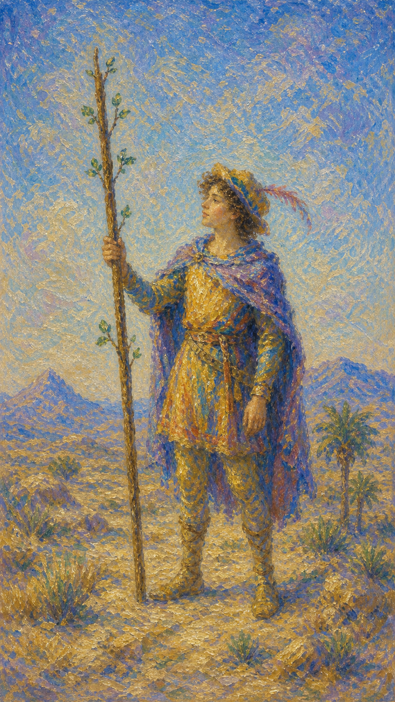
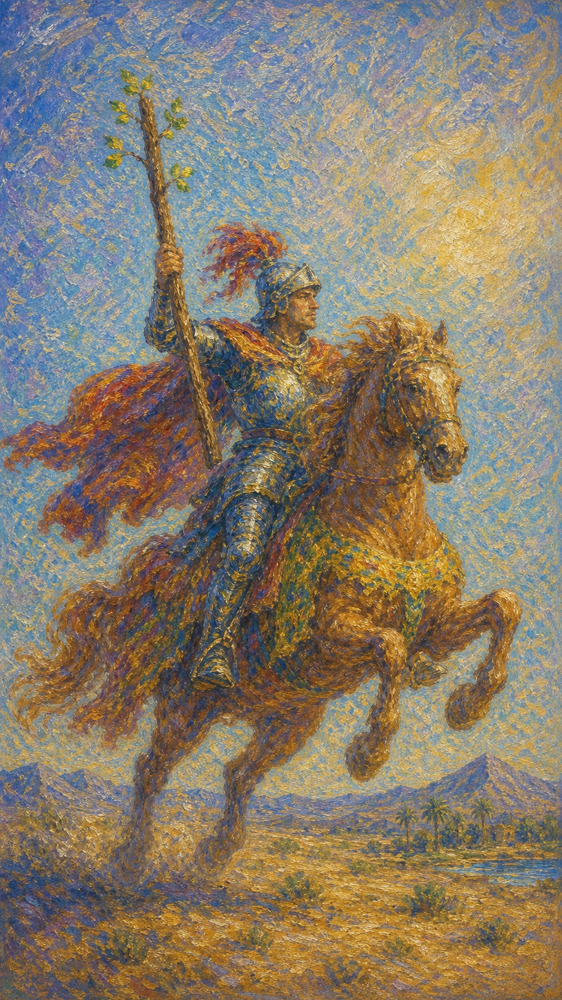
```

Expected: both files keep movement and火元素 active, but avoid making the Page and Knight read as the same personality.

- [ ] **Step 3: Draft `docs/minor/wands/34-queen-of-wands.md` and `docs/minor/wands/35-king-of-wands.md`**

Use image references that match the file slugs:

```md
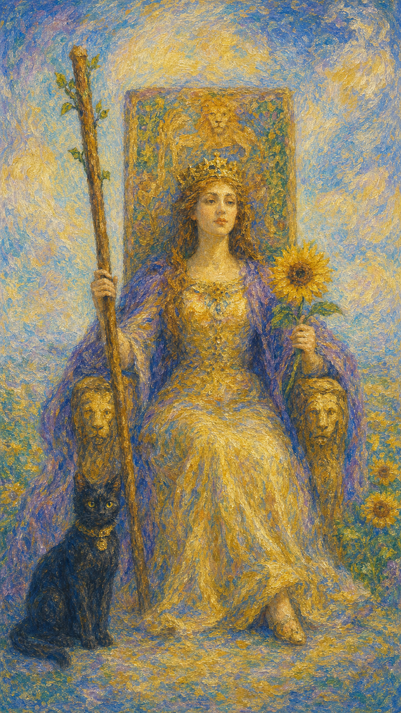
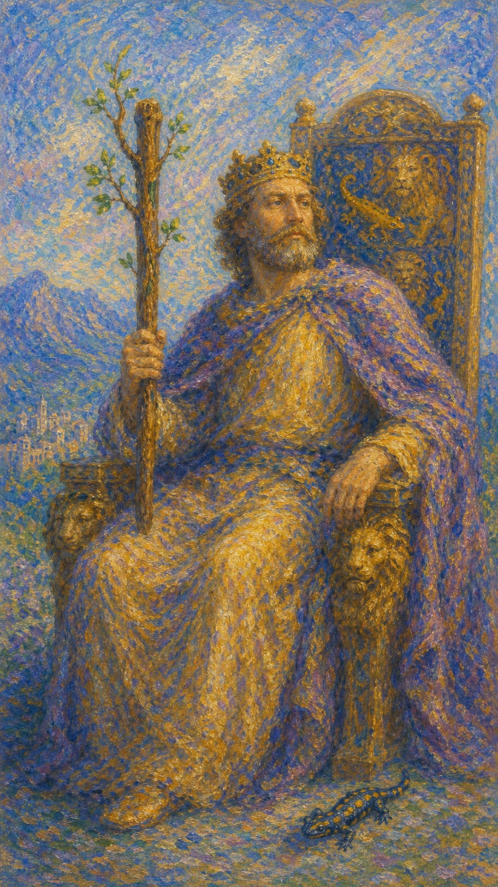
```

Expected: the Queen reads as warm, self-possessed fire; the King reads as directive, strategic fire.

- [ ] **Step 4: Verify the batch**

Run the shared verification script after the four files are saved.

Expected: no missing-section errors in this batch.

- [ ] **Step 5: Checkpoint**

Write a short progress note stating that the Wands suit is complete.

### Task 7: Write the numbered Cups cards

**Files:**
- Create: `docs/minor/cups/36-ace-of-cups.md`
- Create: `docs/minor/cups/37-two-of-cups.md`
- Create: `docs/minor/cups/38-three-of-cups.md`
- Create: `docs/minor/cups/39-four-of-cups.md`
- Create: `docs/minor/cups/40-five-of-cups.md`
- Create: `docs/minor/cups/41-six-of-cups.md`
- Create: `docs/minor/cups/42-seven-of-cups.md`
- Create: `docs/minor/cups/43-eight-of-cups.md`
- Create: `docs/minor/cups/44-nine-of-cups.md`
- Create: `docs/minor/cups/45-ten-of-cups.md`
- Verify: the batch files above with the shared verification script

- [ ] **Step 1: Research the numbered Cups sequence with Tavily**

Use these ten queries before drafting:

```text
Ace of Cups tarot Rider Waite symbolism upright reversed Golden Dawn
Two of Cups tarot Rider Waite symbolism upright reversed Golden Dawn
Three of Cups tarot Rider Waite symbolism upright reversed Golden Dawn
Four of Cups tarot Rider Waite symbolism upright reversed Golden Dawn
Five of Cups tarot Rider Waite symbolism upright reversed Golden Dawn
Six of Cups tarot Rider Waite symbolism upright reversed Golden Dawn
Seven of Cups tarot Rider Waite symbolism upright reversed Golden Dawn
Eight of Cups tarot Rider Waite symbolism upright reversed Golden Dawn
Nine of Cups tarot Rider Waite symbolism upright reversed Golden Dawn
Ten of Cups tarot Rider Waite symbolism upright reversed Golden Dawn
```

Expected: notes that preserve the water suit arc from overflow to union, withdrawal, grief, memory, fantasy, departure, satisfaction, and emotional fulfillment.

- [ ] **Step 2: Draft Ace through Four of Cups**

Create these files:

```text
docs/minor/cups/36-ace-of-cups.md
docs/minor/cups/37-two-of-cups.md
docs/minor/cups/38-three-of-cups.md
docs/minor/cups/39-four-of-cups.md
```

Expected: the sequence reads as opening, bonding, celebration, and emotional disengagement.

- [ ] **Step 3: Draft Five through Seven of Cups**

Create these files:

```text
docs/minor/cups/40-five-of-cups.md
docs/minor/cups/41-six-of-cups.md
docs/minor/cups/42-seven-of-cups.md
```

Expected: the trio distinguishes grief, nostalgia, and fantasy/temptation.

- [ ] **Step 4: Draft Eight through Ten of Cups**

Create these files:

```text
docs/minor/cups/43-eight-of-cups.md
docs/minor/cups/44-nine-of-cups.md
docs/minor/cups/45-ten-of-cups.md
```

Expected: the closing trio distinguishes emotional departure, wish fulfillment, and long-term harmony.

- [ ] **Step 5: Verify the batch**

Run the shared verification script after the ten files are saved.

Expected: no missing-section errors in this batch.

- [ ] **Step 6: Checkpoint**

Write a short progress note stating that the numbered Cups cards are complete.

### Task 8: Write the Cups court cards

**Files:**
- Create: `docs/minor/cups/46-page-of-cups.md`
- Create: `docs/minor/cups/47-knight-of-cups.md`
- Create: `docs/minor/cups/48-queen-of-cups.md`
- Create: `docs/minor/cups/49-king-of-cups.md`
- Verify: the batch files above with the shared verification script

- [ ] **Step 1: Research the Cups court cards with Tavily**

Use these four queries before drafting:

```text
Page of Cups tarot court card personality elemental dignity
Knight of Cups tarot court card personality elemental dignity
Queen of Cups tarot court card personality elemental dignity
King of Cups tarot court card personality elemental dignity
```

Expected: notes that separate emotional curiosity, romantic pursuit, intuitive depth, and emotional mastery.

- [ ] **Step 2: Draft `docs/minor/cups/46-page-of-cups.md` and `docs/minor/cups/47-knight-of-cups.md`**

Use image references that match the file slugs:

```md

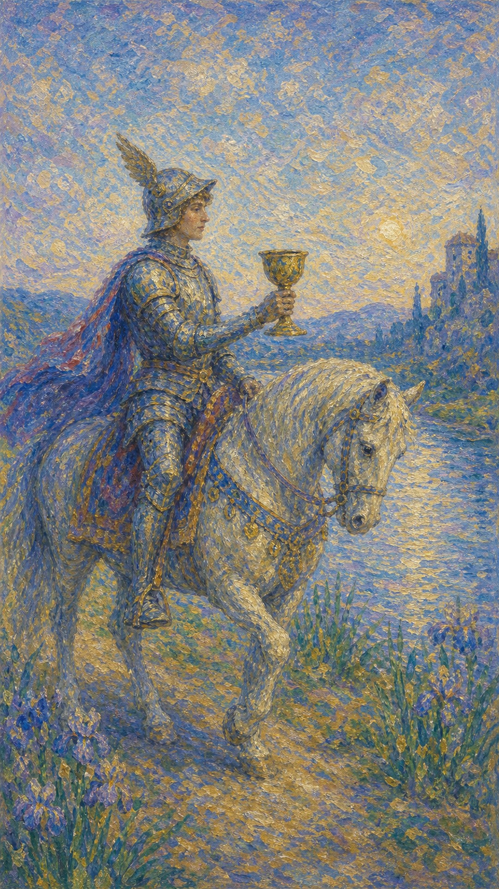
```

Expected: the Page feels fresh and receptive; the Knight feels moving and idealistic.

- [ ] **Step 3: Draft `docs/minor/cups/48-queen-of-cups.md` and `docs/minor/cups/49-king-of-cups.md`**

Use image references that match the file slugs:

```md
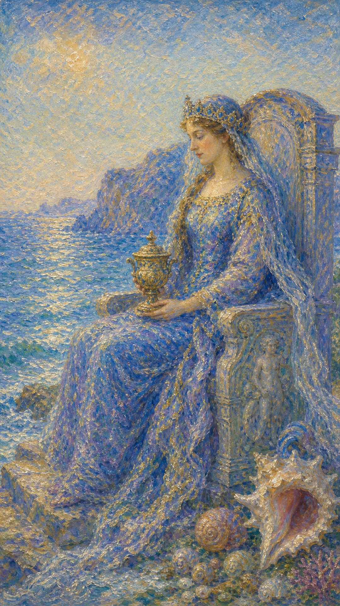
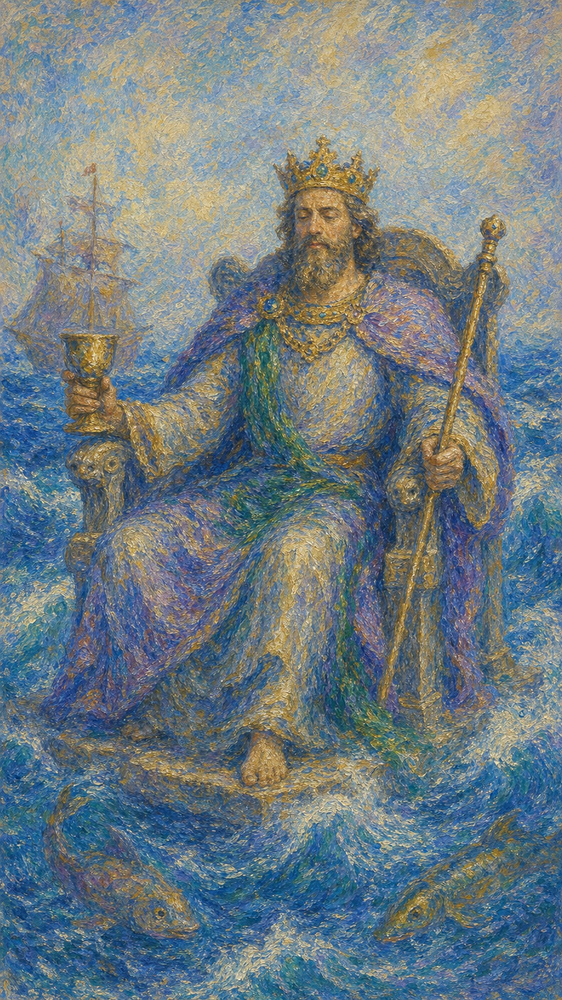
```

Expected: the Queen reads as inwardly attuned water; the King reads as composed, relational authority.

- [ ] **Step 4: Verify the batch**

Run the shared verification script after the four files are saved.

Expected: no missing-section errors in this batch.

- [ ] **Step 5: Checkpoint**

Write a short progress note stating that the Cups suit is complete.

### Task 9: Write the numbered Swords cards

**Files:**
- Create: `docs/minor/swords/50-ace-of-swords.md`
- Create: `docs/minor/swords/51-two-of-swords.md`
- Create: `docs/minor/swords/52-three-of-swords.md`
- Create: `docs/minor/swords/53-four-of-swords.md`
- Create: `docs/minor/swords/54-five-of-swords.md`
- Create: `docs/minor/swords/55-six-of-swords.md`
- Create: `docs/minor/swords/56-seven-of-swords.md`
- Create: `docs/minor/swords/57-eight-of-swords.md`
- Create: `docs/minor/swords/58-nine-of-swords.md`
- Create: `docs/minor/swords/59-ten-of-swords.md`
- Verify: the batch files above with the shared verification script

- [ ] **Step 1: Research the numbered Swords sequence with Tavily**

Use these ten queries before drafting:

```text
Ace of Swords tarot Rider Waite symbolism upright reversed Golden Dawn
Two of Swords tarot Rider Waite symbolism upright reversed Golden Dawn
Three of Swords tarot Rider Waite symbolism upright reversed Golden Dawn
Four of Swords tarot Rider Waite symbolism upright reversed Golden Dawn
Five of Swords tarot Rider Waite symbolism upright reversed Golden Dawn
Six of Swords tarot Rider Waite symbolism upright reversed Golden Dawn
Seven of Swords tarot Rider Waite symbolism upright reversed Golden Dawn
Eight of Swords tarot Rider Waite symbolism upright reversed Golden Dawn
Nine of Swords tarot Rider Waite symbolism upright reversed Golden Dawn
Ten of Swords tarot Rider Waite symbolism upright reversed Golden Dawn
```

Expected: notes that preserve the air suit arc from clarity to stalemate, sorrow, rest, conflict, transition, strategy, entrapment, anxiety, and collapse.

- [ ] **Step 2: Draft Ace through Four of Swords**

Create these files:

```text
docs/minor/swords/50-ace-of-swords.md
docs/minor/swords/51-two-of-swords.md
docs/minor/swords/52-three-of-swords.md
docs/minor/swords/53-four-of-swords.md
```

Expected: the first four files move from truth and decisiveness to pause and recuperation.

- [ ] **Step 3: Draft Five through Seven of Swords**

Create these files:

```text
docs/minor/swords/54-five-of-swords.md
docs/minor/swords/55-six-of-swords.md
docs/minor/swords/56-seven-of-swords.md
```

Expected: the trio distinguishes hollow victory, difficult transition, and stealth/strategy.

- [ ] **Step 4: Draft Eight through Ten of Swords**

Create these files:

```text
docs/minor/swords/57-eight-of-swords.md
docs/minor/swords/58-nine-of-swords.md
docs/minor/swords/59-ten-of-swords.md
```

Expected: the closing trio distinguishes mental restriction, night fear, and painful ending.

- [ ] **Step 5: Verify the batch**

Run the shared verification script after the ten files are saved.

Expected: no missing-section errors in this batch.

- [ ] **Step 6: Checkpoint**

Write a short progress note stating that the numbered Swords cards are complete.

### Task 10: Write the Swords court cards

**Files:**
- Create: `docs/minor/swords/60-page-of-swords.md`
- Create: `docs/minor/swords/61-knight-of-swords.md`
- Create: `docs/minor/swords/62-queen-of-swords.md`
- Create: `docs/minor/swords/63-king-of-swords.md`
- Verify: the batch files above with the shared verification script

- [ ] **Step 1: Research the Swords court cards with Tavily**

Use these four queries before drafting:

```text
Page of Swords tarot court card personality elemental dignity
Knight of Swords tarot court card personality elemental dignity
Queen of Swords tarot court card personality elemental dignity
King of Swords tarot court card personality elemental dignity
```

Expected: notes that separate watchfulness, charge, discernment, and intellectual authority.

- [ ] **Step 2: Draft `docs/minor/swords/60-page-of-swords.md` and `docs/minor/swords/61-knight-of-swords.md`**

Use image references that match the file slugs:

```md


```

Expected: the Page is alert and mentally active; the Knight is forceful and fast-moving.

- [ ] **Step 3: Draft `docs/minor/swords/62-queen-of-swords.md` and `docs/minor/swords/63-king-of-swords.md`**

Use image references that match the file slugs:

```md
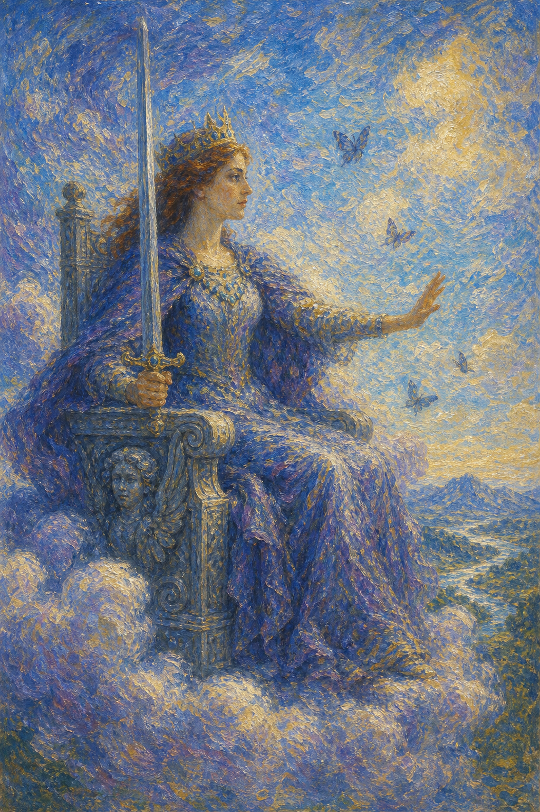
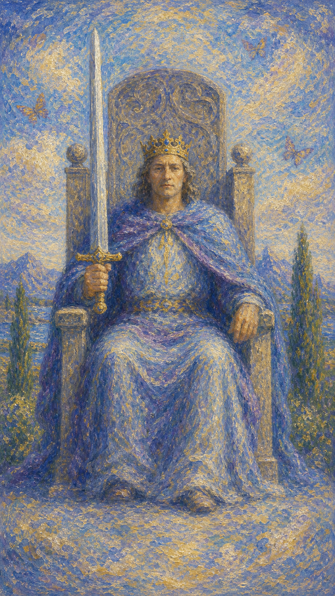
```

Expected: the Queen reads as clear-eyed, independent air; the King reads as law, judgment, and disciplined reason.

- [ ] **Step 4: Verify the batch**

Run the shared verification script after the four files are saved.

Expected: no missing-section errors in this batch.

- [ ] **Step 5: Checkpoint**

Write a short progress note stating that the Swords suit is complete.

### Task 11: Write the numbered Pentacles cards

**Files:**
- Create: `docs/minor/pentacles/64-ace-of-pentacles.md`
- Create: `docs/minor/pentacles/65-two-of-pentacles.md`
- Create: `docs/minor/pentacles/66-three-of-pentacles.md`
- Create: `docs/minor/pentacles/67-four-of-pentacles.md`
- Create: `docs/minor/pentacles/68-five-of-pentacles.md`
- Create: `docs/minor/pentacles/69-six-of-pentacles.md`
- Create: `docs/minor/pentacles/70-seven-of-pentacles.md`
- Create: `docs/minor/pentacles/71-eight-of-pentacles.md`
- Create: `docs/minor/pentacles/72-nine-of-pentacles.md`
- Create: `docs/minor/pentacles/73-ten-of-pentacles.md`
- Verify: the batch files above with the shared verification script

- [ ] **Step 1: Research the numbered Pentacles sequence with Tavily**

Use these ten queries before drafting:

```text
Ace of Pentacles tarot Rider Waite symbolism upright reversed Golden Dawn
Two of Pentacles tarot Rider Waite symbolism upright reversed Golden Dawn
Three of Pentacles tarot Rider Waite symbolism upright reversed Golden Dawn
Four of Pentacles tarot Rider Waite symbolism upright reversed Golden Dawn
Five of Pentacles tarot Rider Waite symbolism upright reversed Golden Dawn
Six of Pentacles tarot Rider Waite symbolism upright reversed Golden Dawn
Seven of Pentacles tarot Rider Waite symbolism upright reversed Golden Dawn
Eight of Pentacles tarot Rider Waite symbolism upright reversed Golden Dawn
Nine of Pentacles tarot Rider Waite symbolism upright reversed Golden Dawn
Ten of Pentacles tarot Rider Waite symbolism upright reversed Golden Dawn
```

Expected: notes that preserve the earth suit arc from opportunity to adaptation, craftsmanship, holding, lack, exchange, patience, effort, autonomy, and legacy.

- [ ] **Step 2: Draft Ace through Four of Pentacles**

Create these files:

```text
docs/minor/pentacles/64-ace-of-pentacles.md
docs/minor/pentacles/65-two-of-pentacles.md
docs/minor/pentacles/66-three-of-pentacles.md
docs/minor/pentacles/67-four-of-pentacles.md
```

Expected: the first four files move from material opening to balancing, skill-building, and control.

- [ ] **Step 3: Draft Five through Seven of Pentacles**

Create these files:

```text
docs/minor/pentacles/68-five-of-pentacles.md
docs/minor/pentacles/69-six-of-pentacles.md
docs/minor/pentacles/70-seven-of-pentacles.md
```

Expected: the trio distinguishes deprivation, giving/receiving, and patient evaluation.

- [ ] **Step 4: Draft Eight through Ten of Pentacles**

Create these files:

```text
docs/minor/pentacles/71-eight-of-pentacles.md
docs/minor/pentacles/72-nine-of-pentacles.md
docs/minor/pentacles/73-ten-of-pentacles.md
```

Expected: the closing trio distinguishes apprenticeship, cultivated independence, and family legacy.

- [ ] **Step 5: Verify the batch**

Run the shared verification script after the ten files are saved.

Expected: no missing-section errors in this batch.

- [ ] **Step 6: Checkpoint**

Write a short progress note stating that the numbered Pentacles cards are complete.

### Task 12: Write the Pentacles court cards

**Files:**
- Create: `docs/minor/pentacles/74-page-of-pentacles.md`
- Create: `docs/minor/pentacles/75-knight-of-pentacles.md`
- Create: `docs/minor/pentacles/76-queen-of-pentacles.md`
- Create: `docs/minor/pentacles/77-king-of-pentacles.md`
- Verify: the batch files above with the shared verification script

- [ ] **Step 1: Research the Pentacles court cards with Tavily**

Use these four queries before drafting:

```text
Page of Pentacles tarot court card personality elemental dignity
Knight of Pentacles tarot court card personality elemental dignity
Queen of Pentacles tarot court card personality elemental dignity
King of Pentacles tarot court card personality elemental dignity
```

Expected: notes that separate practical study, steady labor, grounded care, and material stewardship.

- [ ] **Step 2: Draft `docs/minor/pentacles/74-page-of-pentacles.md` and `docs/minor/pentacles/75-knight-of-pentacles.md`**

Use image references that match the file slugs:

```md
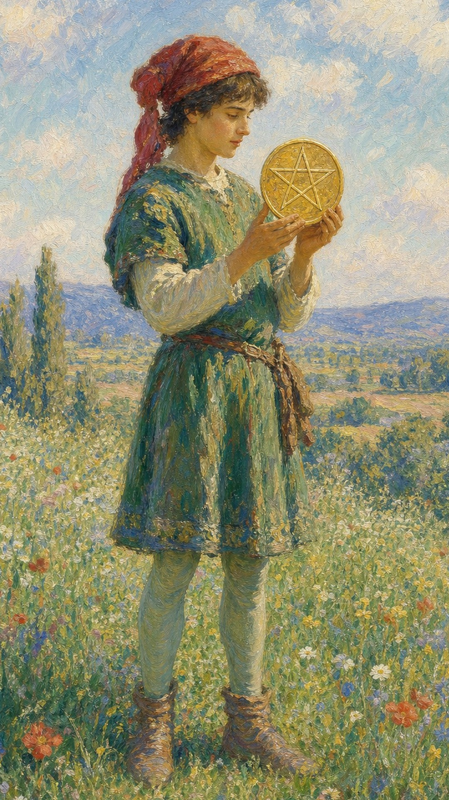
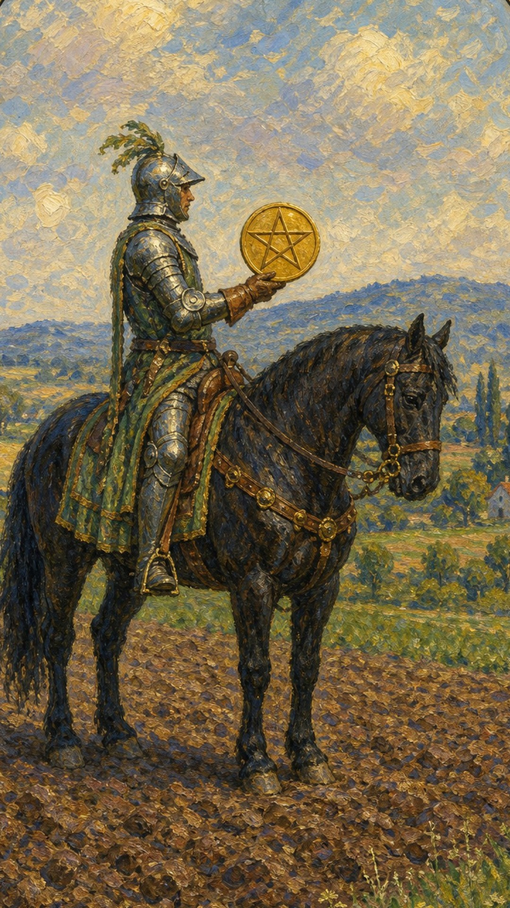
```

Expected: the Page reads as careful learning; the Knight reads as routine, reliability, and persistence.

- [ ] **Step 3: Draft `docs/minor/pentacles/76-queen-of-pentacles.md` and `docs/minor/pentacles/77-king-of-pentacles.md`**

Use image references that match the file slugs:

```md
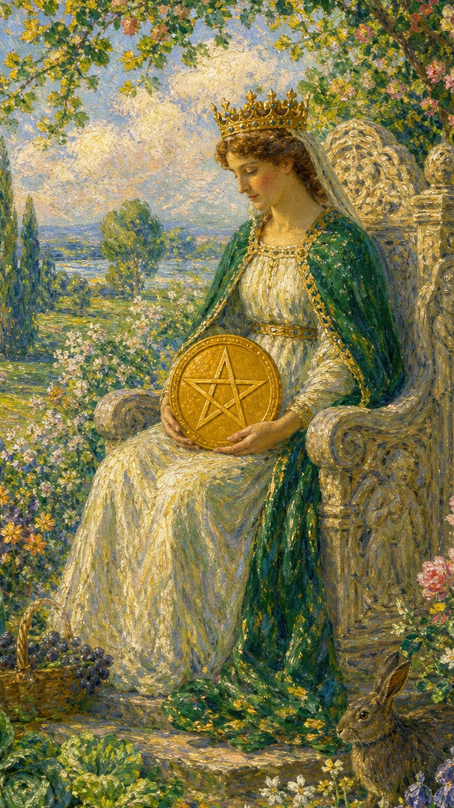
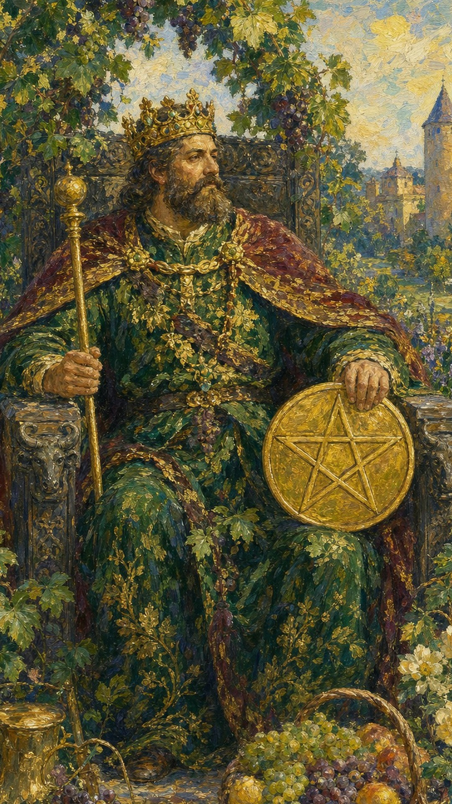
```

Expected: the Queen reads as nurturing earth; the King reads as stable abundance, management, and long-range stewardship.

- [ ] **Step 4: Verify the batch**

Run the shared verification script after the four files are saved.

Expected: no missing-section errors in this batch.

- [ ] **Step 5: Checkpoint**

Write a short progress note stating that the Pentacles suit is complete.

### Task 13: Run the corpus-wide verification sweep

**Files:**
- Verify: all 76 created files listed in this plan
- Verify unchanged: `docs/major/01-the-magician.md`
- Verify unchanged: `docs/major/02-the-high-priestess.md`

- [ ] **Step 1: Run the shared verification script one final time**

Run the shared verification script exactly as written in this plan.

Expected:

```text
OK: verified 76 files
```

- [ ] **Step 2: Verify that the original two major arcana files were not modified**

Run:

```bash
python - <<'PY'
from pathlib import Path
for path in [
    Path('docs/major/01-the-magician.md'),
    Path('docs/major/02-the-high-priestess.md'),
]:
    print(path, path.exists(), path.stat().st_size)
PY
```

Expected: both files still exist and have non-zero size.

- [ ] **Step 3: Count the created files by directory**

Run:

```bash
python - <<'PY'
from pathlib import Path
checks = {
    'major_new': len(list(Path('docs/major').glob('*.md'))) - 4,
    'wands': len(list(Path('docs/minor/wands').glob('*.md'))),
    'cups': len(list(Path('docs/minor/cups').glob('*.md'))),
    'swords': len(list(Path('docs/minor/swords').glob('*.md'))),
    'pentacles': len(list(Path('docs/minor/pentacles').glob('*.md'))),
}
for key, value in checks.items():
    print(f'{key}={value}')
PY
```

Expected:

```text
major_new=20
wands=14
cups=14
swords=14
pentacles=14
```

- [ ] **Step 4: Final checkpoint**

Write a short completion note stating that the repo now contains 76 new tarot interpretation files, grouped under `docs/major` and `docs/minor/*`, with the two original major arcana files preserved.
